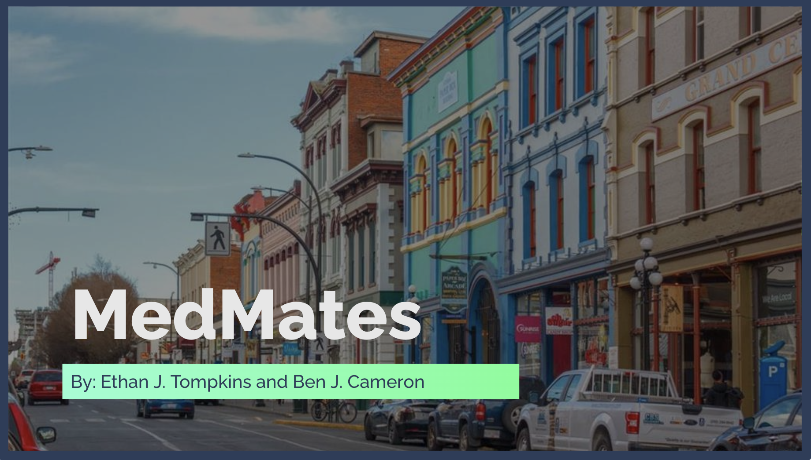

# MedMates

## About

<!-- You will want to modify the text below to include a short description of your app -->
<!-- You will want to modify the documentation link to your app's help page -->

MedMates connects users struggling with substance use and mental health with safe use rooms, hospitals, and counselling services. [Click here to learn more!](https://docs.google.com/presentation/d/1wp13YTnGGdOu0dxuiHRl6ByQdWnHSvCaLhagAQ4Gk3U/edit#slide=id.g4dfce81f19_0_45)

MedMates is the winner of the Fall 2023 Social Impact award.

## Technologies

The MedMates web app uses the following technologies: Node.js, React.js, Firebase, Leaflet, and Bootstrap.

## Getting Started

To get started with the project visit the [`getting started`](docs/GETTING_STARTED.md) documentation. The document outlines how to get a copy running locally/publicly and how to setup the app.

## Contributing

Contributions are always welcome!

See [`CONTRIBUTING`](.github/CONTRIBUTING.md) for ways to get started.

Please adhere to this project's [`code of conduct`](CODE_OF_CONDUCT.md).

## License

The project uses the [MIT LICENSE](https://choosealicense.com/licenses/mit/).

## Authors

<!-- You will want modify the authors list below to include all contributing team members. -->

- Ethan Tompkins
- Ben Cameron
- [@hightechu](https://github.com/hightechu)